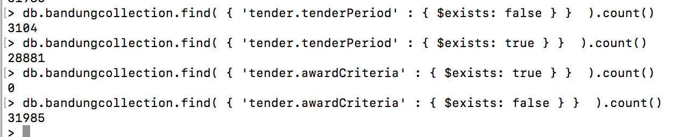

#### Rationale
#### projectID
#### BudgetID
#### Budget year
#### Forecasts

At the planning stage (extension) - for physical and financialProgress

```
"forecasts": [
  {
    "id": "physicalProgress",
    "title": "Physical progress (percent)",
    "observations": [
      {
        "period": {
          "startDate": "2017-02-01T00:00:00+07:00",
          "endDate": "2017-02-01T00:00:00+07:00"
        },
        "measure": "10",
        "unit": {
          "name": "percent",
          "id": "P1",
          "scheme": "UNCEFACT"
        }
      }
    ]
  },
  {
      "id": "financialProgress",
      "title": "Financial progress (Millions of IDR)",
      "observations": [
        {
          "period": {
            "startDate": "2017-02-01T00:00:00+07:00",
            "endDate": "2017-02-01T00:00:00+07:00"
          },
          "measure": "10",
          "unit": {
            "name": "percent",
            "id": "P1",
            "scheme": "UNCEFACT"
          }
        }
      ]
    }
  ]
```

#### tender.awardCriteria


#### anything related to documents?

#### date

Release Date:The date this information was first released, or published.

It looks like it is related to 2016_birms_eproject_planning > tbl_sirup >	tanggal_awal_pengadaan (initial procurement date)


#### Buyer Id

ID is not there https://birms.bandung.go.id/beta/api/newcontract/ocds-afzrfb-s-2016-6861142
can't match the buyer
