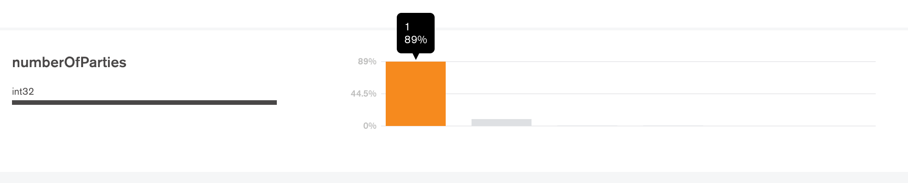

# API Statistics

#### Average number of parties

89% have 1 party.
Decided to drop Procurement Entity and Buyer. Put procurement entity only.




##### command

```
db.bandungcollection.aggregate(
   [
      {
         $project: {
            item: 1,
            numberOfParties: { $size: "$parties" }
         }
      },
      {
        $out : "numberOfParties"
      }
   ]
)
```

db.bandungcollection.tender.aggregate(
   [
      {
         $project: {
            item: 1,
            numberOfawardCriteria: { $size: "$awardCriteria" }
         }
      },
      {
        $out : "numberOfawardCriteria"
      }
   ]
)

db.bandungcollection.find( { 'awardCriteria' : { $exists: false } } , { $out : "noAwardCriteria" }  )

db.bandungcollection.find(
  [
    { 'tender.awardCriteria' : { $exists: false } },
    { $out : "noAwardCriteria" }
  ]
)


db.bandungcollection.find({ $and: [ { 'parties.roles' :  "buyer" },{'parties.address': {$exists: true}}, {'buyer.id' : { $exists: false } }  ]} ).pretty()
> db.bandungcollection.find({ $and: [ { 'parties.roles' :  "buyer" }, {'buyer.id' : { $exists: false } }  ]} ).pretty()
> db.bandungcollection.find({ $and: [ { 'parties.roles' :  "procuringEntity" }, {'tag': 'planning'} , {'tag': { $ne: "tender"}}  ]} ).pretty()
> db.bandungcollection.find( { 'parties.address.streetAddress' : { $exists: false } }  ).count()
> db.bandungcollection.find( { 'parties.address' : { $exists: false } }  ).count()
> db.bandungcollection.find( { 'buyer.name' : { $exists: false } }  ).count()
> db.bandungcollection.find( { 'buyer.id' : { $exists: true } }  ).count()
